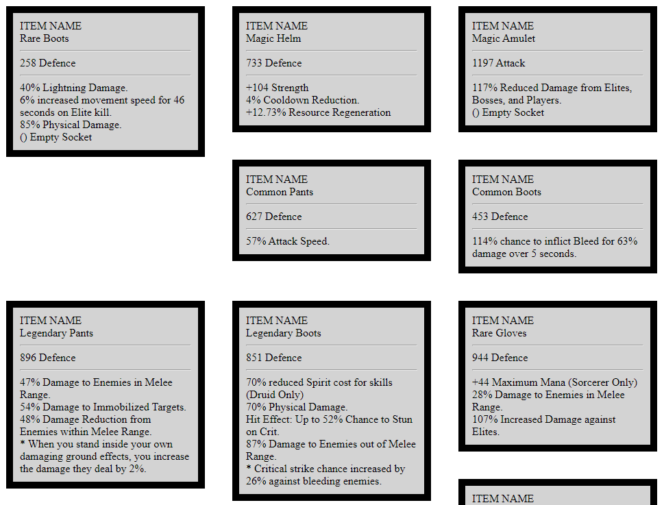

# Diablo 4 item generator

The idea is to develop an item generator for the upcoming Diablo 4 game.  
I believe it would be nice to have an easy way to generate samples of items according to information we already know, and also adding speculations. So we, as players, can have a much richer discussion about the itemization of the game, while also giving feedback to the Diablo team.  

Please, check **todo.txt** to see some suggestions of what to do next.  
Feel free to contribute and expand the project in any way you want.


## Running
```
Flask==1.1.2
```

Run the script by calling, and then access localhost:5000 on your browser.
```
python main.py
```


## Examples

